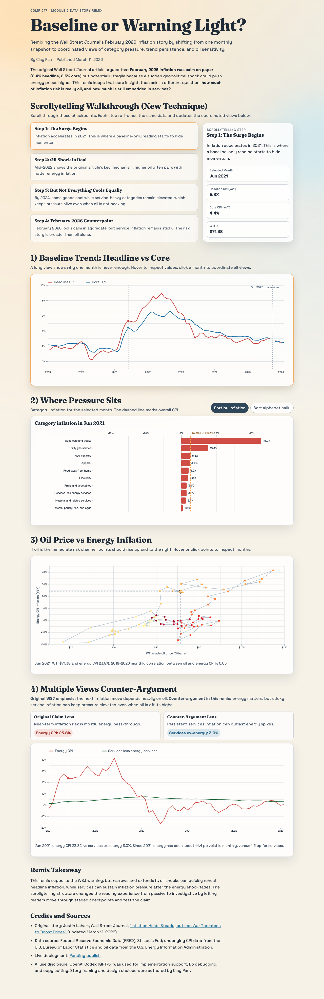

# Baseline or Warning Light? (COMP 617 Module 2 Remix)

## Project
- **Author:** Clay Parr
- **Live deployment:** <https://cparr110.github.io/comp-617-module-two-remix-cparr110/>
- **Local entry file:** `index.html`



## Original Piece + Credits
- **Original story remixed:** Justin Lahart, Wall Street Journal, "Inflation Holds Steady, but Iran War Threatens to Boost Prices" (updated March 11, 2026).
- **Link:** <https://www.wsj.com/economy/cpi-inflation-report-february-2026-df32173e?st=pou3u9&reflink=desktopwebshare_permalink>

## Data Sources
- Federal Reserve Economic Data (FRED), St. Louis Fed.
- Underlying CPI series from the U.S. Bureau of Labor Statistics.
- Oil price series from the U.S. Energy Information Administration.

## Remix Design and Story Argument
The WSJ piece frames February 2026 as calm inflation with potential oil-driven upside risk. This remix keeps that framing, then broadens it with coordinated views that test whether persistent service inflation also matters.

Visual structure in the final story:
1. **Headline vs Core Trend (interactive D3 line chart):** click/hover month selection.
2. **Category Pressure (interactive D3 diverging bars):** sorted rank or alphabetical scan.
3. **Oil vs Energy Link (interactive D3 scatter):** month-by-month risk channel testing.
4. **Counter-Argument View (interactive D3 line chart):** energy CPI vs services-less-energy CPI.

## Bells and Whistles Completed
1. **Live Deployment:** Published via GitHub Pages.
2. **View Coordination:** Interacting with one chart updates the selected month in the others.
3. **New Technique:** Added a scrollytelling walkthrough with scroll-activated checkpoints.
4. **Multiple Views / Counter-Argument:** Added explicit "original claim vs counter-argument" text and chart evidence.

## Addendum: Effect of New Technique
I changed from a static magazine-style flow to scrollytelling. Readers now move through four checkpoints (surge, oil shock, cooling, February baseline), and the coordinated charts update per step. This creates a guided comparison process rather than a single fixed interpretation.

## Run Locally
```bash
node scripts/build-data.mjs
python3 -m http.server 8000
```
Then open <http://localhost:8000>.

## AI Use Disclosure
OpenAI Codex (GPT-5) was used for implementation support, D3 debugging, and copy editing. The story framing, visual argument, and design decisions were authored by Clay Parr.
